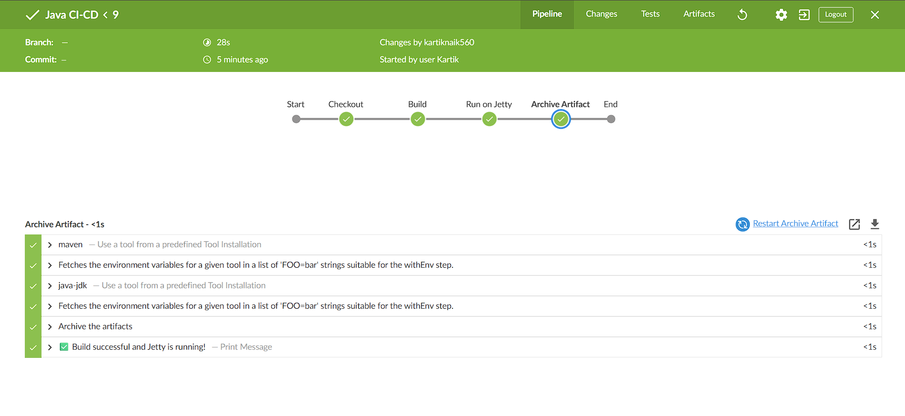
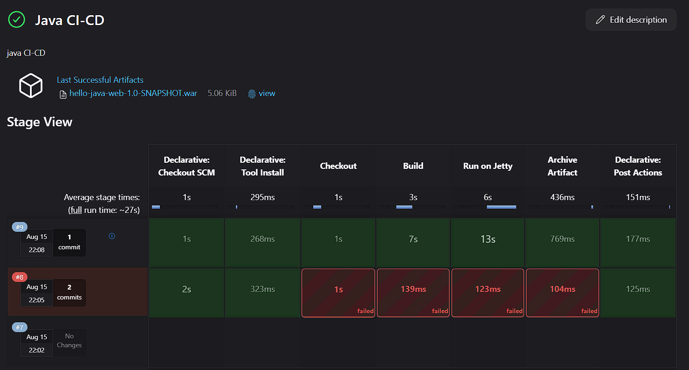

<h1 align="center">🚀 Hello Java Web (Maven + Jetty + Jenkins CI)</h1>

<p align="center">
A simple Java web application built with <b>Servlets</b> and <b>JSP</b>, packaged as a WAR file with Maven,<br>
and served via <b>Jetty</b>. Automated builds and deployments are handled with <b>Jenkins</b>.
</p>

## 📸 Screenshots

### App Homepage


### Jenkins Build Success


### Jenkins Pipeline View


---

## 📌 Features
- 📦 **Maven** build system (`clean package`)
- 🌐 **Jetty** for running the app locally
- ⚡ **Jenkins Pipeline** for CI automation
- 📂 Clean folder structure for easy navigation
- 🔄 Ready for deployment to servlet containers (WAR)

---

## 🛠 Tech Stack
- **Java** 8+  
- **Maven** 3.8+  
- **Jetty Maven Plugin**  
- **Jenkins** (for CI)

---

## 📂 Folder Structure

```

hello-java-web/  
├── pom.xml  
└── src/  
├── main/  
│ ├── java/  
│ │ └── com/example/HelloServlet.java  
│ └── webapp/  
│ ├── index.jsp  
│ └── WEB-INF/web.xml

```

---

## 🚀 Run Locally with Maven + Jetty

### 1️⃣ Build the Project
```bash
mvn clean package

```

This will generate:

```
target/hello-java-web-1.0-SNAPSHOT.war

```

### 2️⃣ Start Jetty

```bash
mvn jetty:run

```

The app will be available at:

```
http://localhost:8080

```

----------

## ⚙️ Jenkins Pipeline Setup

This project uses a `Jenkinsfile` for Pipeline builds.

### Pipeline Stages

1.  **Checkout** → Pulls code from GitHub.
    
2.  **Build** → Runs `mvn clean package`.
    
3.  **Run on Jetty** → Starts Jetty with the latest WAR.
    
4.  **Archive Artifacts** → Stores WAR in Jenkins build history.
    

----------


